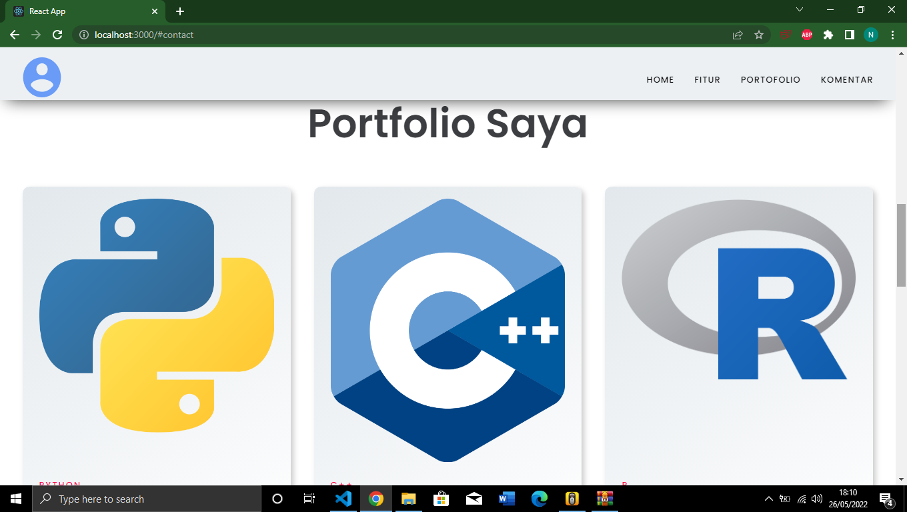

# Praktikum Minggu 2
Praktikum React JS 
Nama: Nesa Oktavia  
NIM: 119140091  

to run this web:  
npm install yarn  
yarn start  
"dependencies": {  
        "@testing-library/jest-dom": "^5.16.3",  
        "@testing-library/react": "^12.1.4",  
        "@testing-library/user-event": "^13.5.0",  
        "axios": "^0.26.1",  
        "react": "^17.0.2",  
        "react-dom": "^17.0.2",  
        "react-router-dom": "^6.3.0",  
        "react-scripts": "5.0.0",  
        "react-simple-typewriter": "^3.0.1",  
        "web-vitals": "^2.1.4",  
        "yarn": "^1.22.18"  
      } 
Tampilan Web

